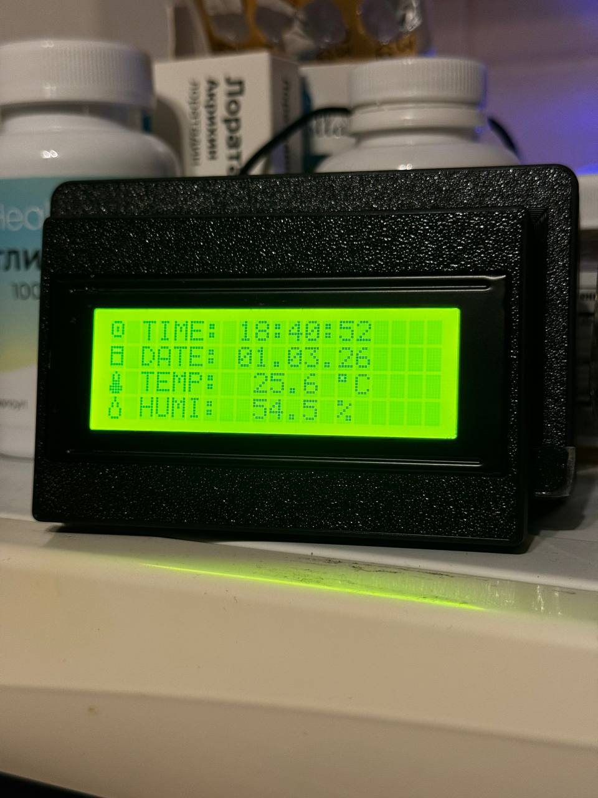
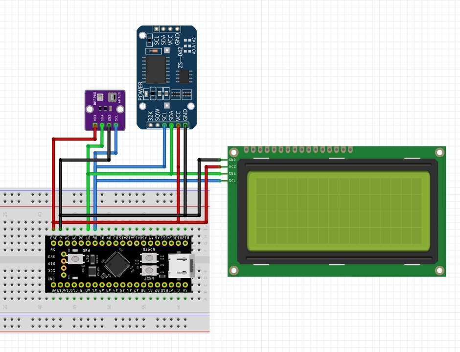
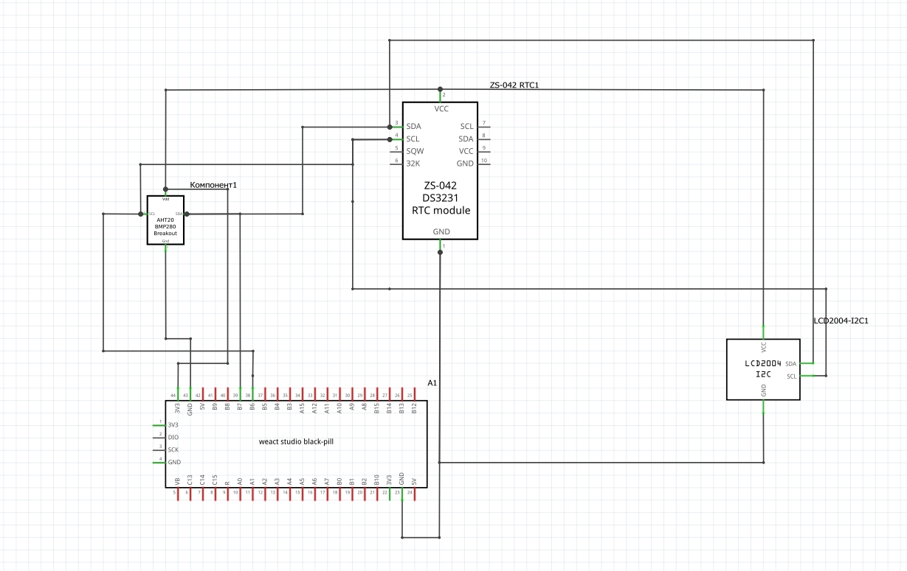

# STM32 Meteo Station 🌦️

Weather station based on **STM32F401 BlackPill** using several I2C sensors and a 20x4 LCD display.

Метеостанция на базе **STM32F401 BlackPill** с несколькими датчиками по I2C и LCD-дисплеем 20×4.

---

## 📷 Device / Устройство




---

## 🧩 Hardware / Аппаратная часть

**MCU**

* STM32F401 BlackPill (STM32F401CCU6)

**Sensors**

* AHT20 — temperature & humidity / температура и влажность
* BMP280 — atmospheric pressure / атмосферное давление
* DS3231 — real time clock / часы реального времени

**Display**

* LCD2004 20×4 with I2C backpack (PCF8574)

All modules are connected via a shared **I2C bus**.
Все модули подключены к общей **шине I2C**.

---

## ⚙️ Features / Возможности

* Temperature measurement / измерение температуры
* Humidity measurement / измерение влажности
* Real-time clock / часы реального времени
* Data output to LCD2004 / вывод данных на LCD дисплей

---

## 🖥 Example LCD Output / Пример вывода на LCD

```
Time: 21:48:12
Date: 01.01.26
Temp: 23.4 C
Hum : 41 %
```

---

## 🔌 Hardware Connection / Подключение устройств

### Wiring diagram (как подключить)



### Schematic (электрическая схема)



---

## 📡 I2C Devices / Устройства I2C

| Device            | Address     |
| ----------------- | ----------- |
| AHT20             | 0x38        |
| DS3231            | 0x68        |
| LCD2004 (PCF8574) | 0x27 / 0x3F |

---

## 📍 MCU Pinout / Распиновка микроконтроллера

| STM32 Pin | Function |
| --------- | -------- |
| PB6       | I2C1_SCL |
| PB7       | I2C1_SDA |
| 3.3V      | Power    |
| GND       | Ground   |

---

## 📂 Project Structure / Структура проекта

```
Core/
    Inc/        # Header files
    Src/        # Firmware source code

Drivers/
    CMSIS       # ARM CMSIS
    STM32 HAL   # STM32 HAL drivers

Startup/        # MCU startup code
```

---

## 🛠 Development Environment / Среда разработки

* **STM32CubeIDE**
* **STM32 HAL**
* **ARM GCC toolchain**

---

## 🚀 Build / Сборка и прошивка
### English
1. Open the project in **STM32CubeIDE**
2. Build the project
3. Flash using **ST-Link**

### Русский
1. Откройте проект в **STM32CubeIDE**
2. Соберите проект (`Project → Build`)
3. Прошейте микроконтроллер с помощью **ST-Link**
---

## 🧰 Enclosure / Корпус

### English
The enclosure used in this project is based on the following 3D model:

https://www.printables.com/model/308120-box-for-lcd-2004-with-wemos-d1

The model was **not created by me** and is used according to the original author's publication on Printables.

You may need to slightly modify the model depending on your hardware configuration.

### Русский
В проекте используется 3D-модель корпуса из следующего источника:

https://www.printables.com/model/308120-box-for-lcd-2004-with-wemos-d1

Модель **не является моей разработкой** и используется согласно публикации оригинального автора на Printables.

В зависимости от используемых модулей корпус может потребовать небольшой доработки.

## 👤 Author / Автор

idaniil24
